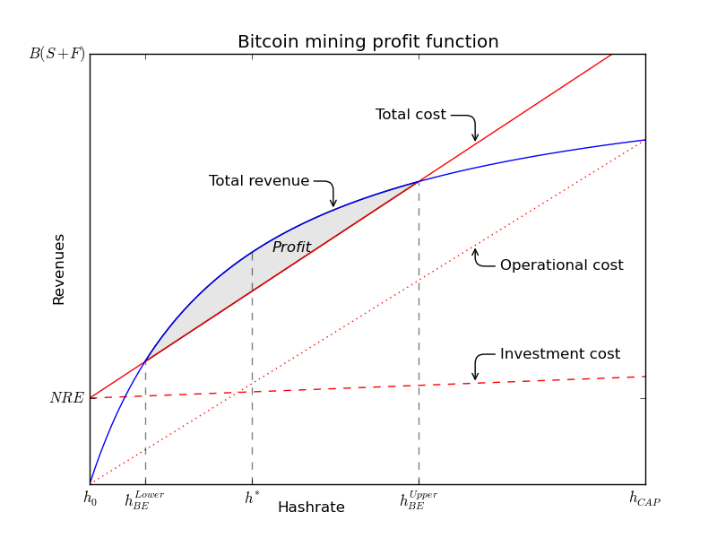

# Overview

This repository contains the code used to model Bitcoin mining profitability as described in "Minting Money With Megawatts", an article which appeared as a cover feature of the Proceedings of the IEEE | Vol. 104, No. 9, September 2016. 

# Where to start?

Start with the notebook MiningProfitability.ipynb at:

https://github.com/sweyn/bitcoin-mining-profitability/blob/master/MiningProfitability.ipynb

# Administrative

Content provided under a Creative Commons Attribution-NonCommercial-ShareAlike (CC BY-NC-SA) (c)2013-2022, Sveinn Valfells and Jon Helgi Egilsson. 

# Acknowledgements

Thanks to Agust Valfells, Sigurdur Johannesson and Stephen Harrington. Plots made with [Matplotlib](http://matplotlib.org).
