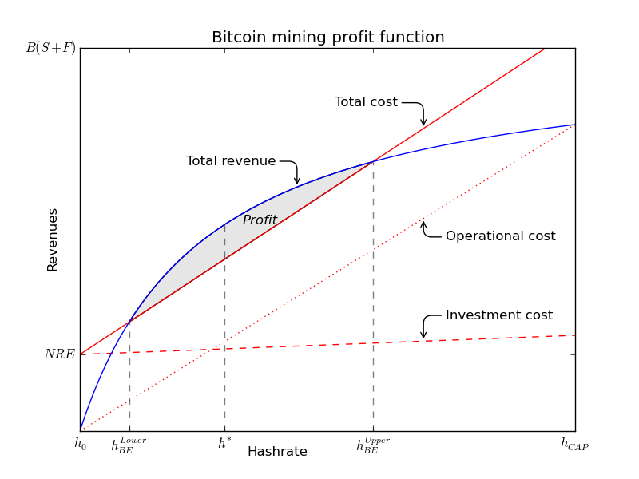

# Overview

This repository contains the code used to model Bitcoin mining profitability as described in "Minting Money With Megawatts", an article which appeared as a cover feature of the Proceedings of the IEEE | Vol. 104, No. 9, September 2016. 

# Requirements

Python 3

# Where to start?

Start with the notebook MiningProfitability.ipynb at:

https://github.com/sweyn/bitcoin-mining-profitability/blob/master/MiningProfitability.ipynb

# Model review (May 2026)

All reference parameters were refreshed to May 2026 market and industry data. With current inputs — BTC at $78K, network hashrate at 960 EH/s, Bitmain S21 XP hardware at 13.5 J/TH, competitive electricity at $0.055/kWh, PUE 1.10, and 95% utilization — the model places the optimal total hashrate h\* ≈ 947 EH/s, within ~1% of the observed network. This near-exact match reflects competitive equilibrium: miners have entered until marginal profit approaches zero, exactly as the model predicts.

The model's functional form and core insight have held up well over a decade. Its principal limitation is that it is static and deterministic — it gives a point-in-time answer in a market where BTC price, fees, and hashrate are highly volatile. At current conditions h\* and h₀ are within 1% of each other, meaning small changes in any input flip the profitability conclusion. A probabilistic extension (e.g. Monte Carlo over price and hashrate scenarios) would be the most valuable next step.

# Documentation

- [docs/claude-review.md](docs/claude-review.md) — Full model review following May 2026 parameter refresh
- [docs/market-data-update-summary.md](docs/market-data-update-summary.md) — Summary of all parameter changes from 2016 to May 2026 values, with sources
- [docs/extrema-check.md](docs/extrema-check.md) — Analytical derivation of h\*, h_CAP, and h_BE with numerical verification

# Administrative

Content provided under a Creative Commons Attribution-NonCommercial-ShareAlike (CC BY-NC-SA) (c)2013-2026. 

# Acknowledgements

Thanks to Agust Valfells, Sigurdur Johannesson and Stephen Harrington. Plots made with [Matplotlib](http://matplotlib.org).
